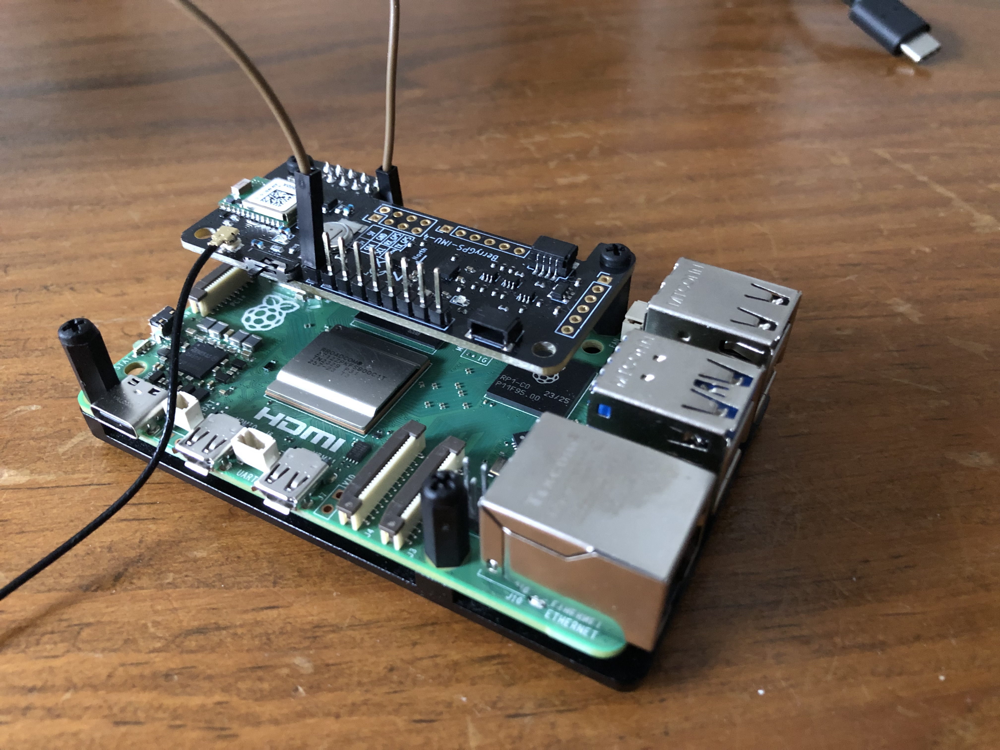
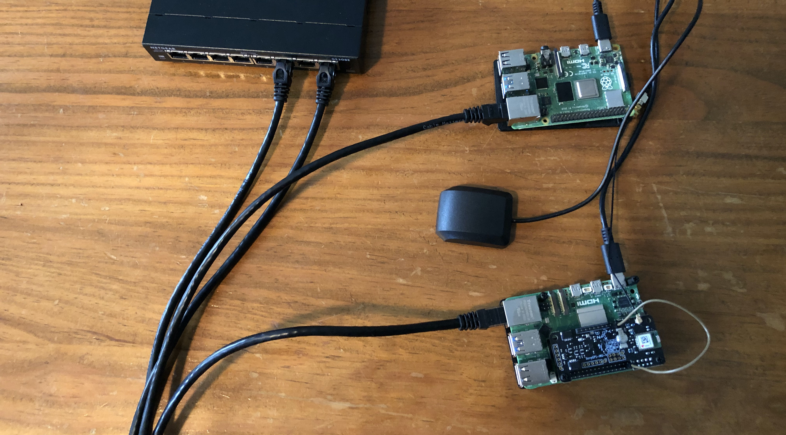
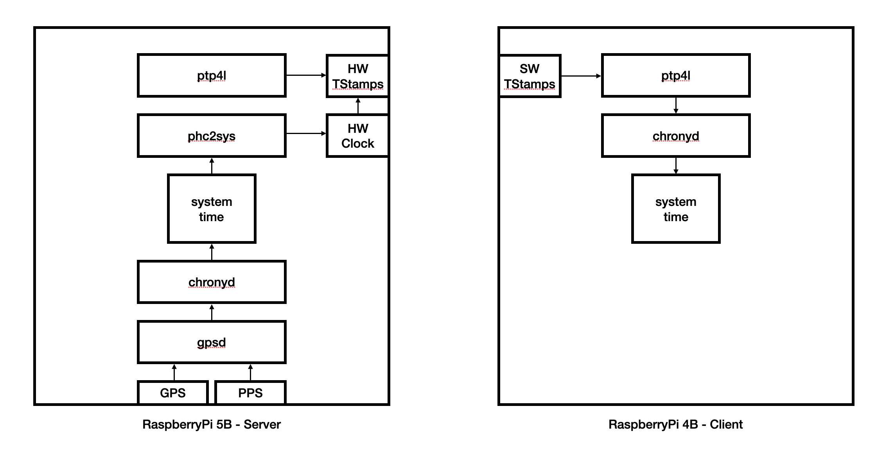

# RaspberryPi5 GPS/PPS Timeserver

This repo contains instructions for building a timeserver using GPS/PPS as the reference clock. It
uses NTP and PTP to share time with the local network.

The key hardware components used are:

* [RaspberryPi 5B](https://www.raspberrypi.com/products/raspberry-pi-5/)
* [BerryGPS-IMU v4](https://ozzmaker.com/product/berrygps-imu/)
* [GPS External Antenna](https://ozzmaker.com/product/antenna-for-berrygps-and-berrygps-imu/)
* [RaspberryPi 4B](https://www.raspberrypi.com/products/raspberry-pi-4-model-b/)
* Network switch
* Network cables

You'll also need SD cards, power supplies and probably cases for your RaspberryPis.

The Pi5B has a network card with support for PTP hardware timestamping, although it could also be done with 
PTP software timestamping on an earlier version of the Pi.

The Pi4 is used for the client because I had one already. The setup described for the Pi4 client should be easily 
transferred to any Linux machine.

The images below show the Pi5 with the BerryGPS-IMU HAT attached, and the complete hardware system:

<table>
    <tr>
        <td></td>
        <td></td>
    </tr>
</table>

And the software components are a bit like this:

## Server

Instructions for the server setup are [here](docs/server.md)

## Client

Instructions for the client setup are [here](docs/client.md)

## GPS Configuration

Instructions for customising the GPS configuration are [here](docs/gps-configuration.md)

## Reference

Great Example using NTP

* https://www.satsignal.eu/ntp/Raspberry-Pi-NTP.html

RaspberryPi

* https://www.raspberrypi.com/products/raspberry-pi-5/
* https://www.raspberrypi.com/software/
* https://www.raspberrypi.com/documentation/

BerryGPS-IMU

* https://ozzmaker.com/berrygps-setup-guide-raspberry-pi/

UARTs

* https://www.raspberrypi.com/documentation/computers/configuration.html#configuring-uarts
* https://forums.raspberrypi.com/viewtopic.php?t=359132

PPS

* https://www.kernel.org/doc/html/latest/driver-api/pps.html
* https://forums.raspberrypi.com/viewtopic.php?t=195011

GPSd

* https://gpsd.io/
* https://gpsd.io/gpsd-time-service-howto.html#_providing_local_ntp_service_using_ptp

Chrony

* https://gpsd.io/gpsd-time-service-howto.html#_feeding_chrony_from_gpsd
* https://chrony-project.org/
* https://chrony-project.org/comparison.html

PTP

* https://access.redhat.com/documentation/en-us/red_hat_enterprise_linux/6/html/deployment_guide/s0-serving_ntp_time_with_ptp

